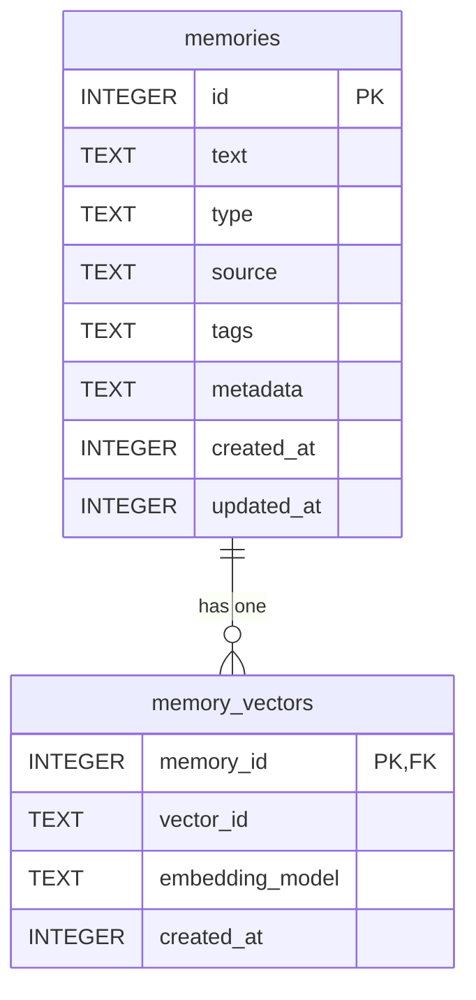

# Data Model: Second Brain MCP

This document defines the core data entities for the Second Brain MCP service, based on the feature specification and the required D1 schema.

## Entity Relationship Diagram (ERD)

---

## Entity Definitions

### 1. `memories`

Stores the primary text content and metadata for each memory.

| Column | Type | Constraints | Description |
|---|---|---|---|
| `id` | `INTEGER` | `PRIMARY KEY AUTOINCREMENT` | Unique identifier for the memory. |
| `text` | `TEXT` | `NOT NULL` | The main content of the memory. |
| `type` | `TEXT` | `NOT NULL`, `CHECK(type IN (...))` | The category of the memory (e.g., 'note', 'research', 'idea'). |
| `source` | `TEXT` | (nullable) | The origin of the memory (e.g., 'gemini', 'manual', 'sabiya'). |
| `tags` | `TEXT` | (nullable) | A JSON array of string tags for filtering. |
| `metadata` | `TEXT` | (nullable) | A JSON object for storing arbitrary additional data. |
| `created_at` | `INTEGER` | `NOT NULL` | UNIX timestamp of when the record was created. |
| `updated_at` | `INTEGER` | `NOT NULL` | UNIX timestamp of when the record was last updated. |

**Validation Rules**:
- `text` must not be empty.
- `type` must be one of the allowed values: `'note', 'research', 'survey', 'idea', 'decision', 'backlog', 'learning'`.
- `tags` and `metadata`, if provided, must be valid JSON.

### 2. `memory_vectors`

Links a memory in the `memories` table to its corresponding vector in the Cloudflare Vectorize index.

| Column | Type | Constraints | Description |
|---|---|---|---|
| `memory_id` | `INTEGER` | `PRIMARY KEY`, `FOREIGN KEY` | References `memories.id`. Ensures a 1-to-1 relationship. |
| `vector_id` | `TEXT` | `NOT NULL UNIQUE` | The unique ID of the vector in the Vectorize index. |
| `embedding_model` | `TEXT` | `NOT NULL` | The model used to generate the embedding (e.g., `@cf/baai/bge-base-en-v1.5`). |
| `created_at` | `INTEGER` | `NOT NULL` | UNIX timestamp of when the vector was created. |

**Relationships**:
- A `memory_vectors` record cannot exist without a corresponding `memories` record.
- Deleting a record from `memories` will cascade and delete the corresponding `memory_vectors` record.
